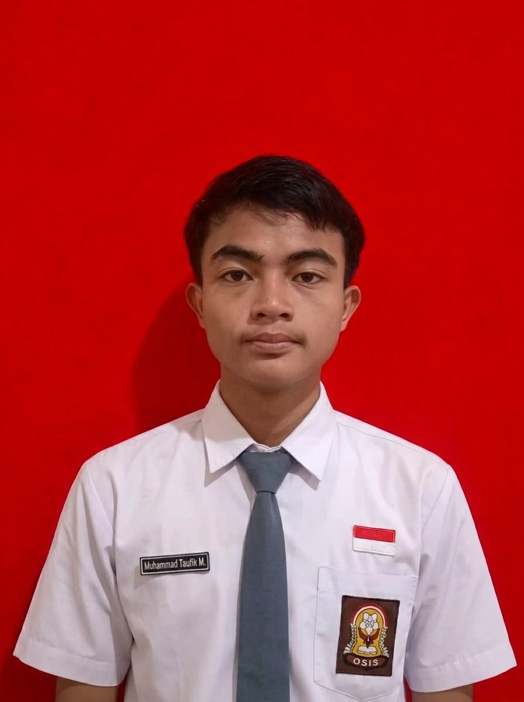

<!DOCTYPE html>
<html lang="id">
<head>
    <meta charset="UTF-8">
    <meta name="viewport" content="width=device-width, initial-scale=1.0">
    <title>Data Diri - Portofolio</title>
    
</head>
<body>

    

        <!-- Header Nama & Foto -->
        

            <!-- Tag Foto Profil -->
            
            <h1>Nama Lengkap Anda</h1>
            
Siswa / Student / Web Developer

        

        <!-- Isi Data Diri -->
        

            
            
BIODATA DIRI

            <table class="info-table">
                <tr>
                    <td class="label">Nama Lengkap</td>
                   <td>: Muhammad Taufik Maulana</td>
                </tr>
                <tr>
                    <td class="label">Tempat, Tgl Lahir</td>
                    <td>: Banyumas, 05 November 2009</td>
                </tr>
                <tr>
                    <td class="label">Jenis Kelamin</td>
                    <td>: Laki-laki </td>
                </tr>
                <tr>
                    <td class="label">Alamat</td>
                    <td>: Jl. Banyumas Kemranj, RT 03/RW 01, Kejawar, Banyumas, Kab. Banyumas, Jawa Tengah.</td>
                </tr>
                <tr>
                    <td class="label">Email</td>
                    <td>: muhammadtaufikk12345@gmail.com</td>
                </tr>
            </table>

            
PENDIDIKAN

            <ul>
               <li><strong>SMK Negeri 1 Banyumas</strong> (2025 - Sekarang)</li>
                <li><strong>SMP Negeri 3 Banyumas</strong> (2022 - 2025)</li>
		<li><strong>SD Negeri 1 Kejawar</strong> (2016 - 2022)</li>
            </ul>

            
KEAHLIAN

            <ul>
				<li>Cyber Security</li>
            </ul>
                <li>HTML & CSS</li>
                <li>Dasar Pemrograman PHP</li>
                <li>Microsoft Office / Excel</li>
            </ul>
			<li>Menguasai Semua Bidang</li>
            </ul>

        

        

            &copy; 2026 Web Data Diri
        

    

</body>
</html>
